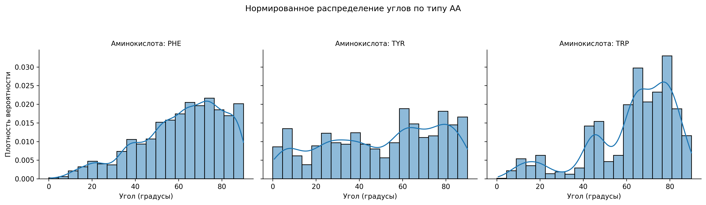
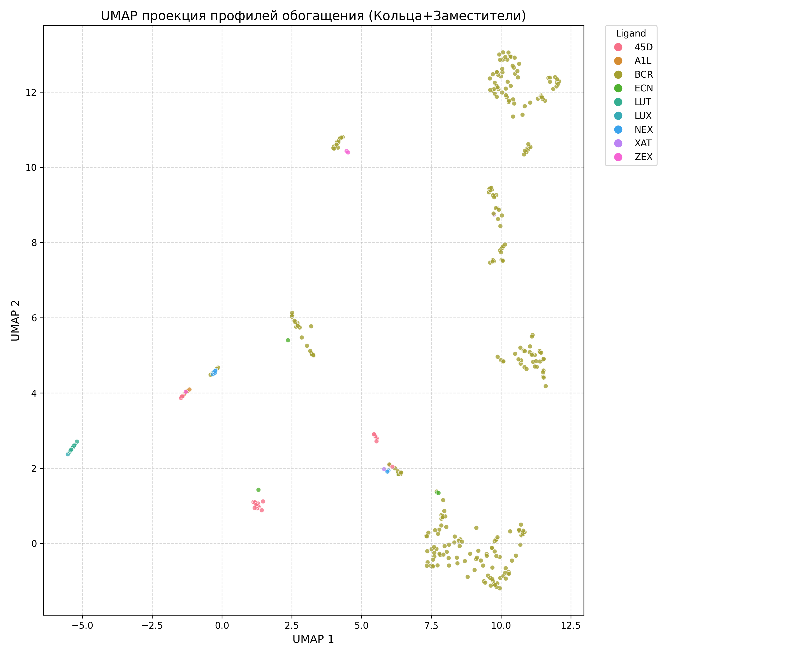

# Carotenoid-Aromatic Amino Acid Interaction Analysis Pipeline

This project provides a suite of Python scripts to analyze interactions between carotenoid ligands and aromatic amino acids (PHE, TYR, TRP) in protein structures from the PDB. It automates data fetching, environment analysis, geometric calculations, statistical enrichment, and visualization (2D and 3D).

## Project Overview

The pipeline performs the following major tasks:

1.  **Data Acquisition (`parse.py`):**
    *   Searches the RCSB PDB for structures containing specified carotenoid ligand codes.
    *   Fetches metadata for these structures using RCSB Data API, GraphQL (for TaxID, EMDB ID), and web scraping (for organism names).
    *   Downloads PDBx/mmCIF files for the identified structures.
    *   (Optionally) Downloads EMDB map files if available.

2.  **Neighbor Analysis & Enrichment (`analyze_pdb.py`):**
    *   Identifies amino acid residues in the vicinity of carotenoid ligands. Two modes:
        *   Environment of the carotenoid's ring systems and their first-shell substituents.
        *   Environment of the entire carotenoid chain.
    *   Calculates the frequency of neighboring amino acids.
    *   Determines Log2 enrichment of amino acids compared to Swiss-Prot background frequencies.
    *   Performs statistical tests (Chi-squared for overall distribution, Binomial test per amino acid with FDR correction) to assess the significance of enrichment.
    *   Generates various plots:
        *   Enrichment score histograms (overall and per ligand).
        *   Clustered heatmap of enrichment profiles across PDB structures.
        *   UMAP projection of enrichment profiles.
    *   Saves raw neighbor data and statistical results to CSV files.

3.  **Geometric Analysis (`analyze_geometry.py`):**
    *   Focuses on interactions between carotenoid ionone rings and aromatic amino acid rings (PHE, TYR, TRP).
    *   Calculates:
        *   Distance between the centroids of the ionone and aromatic rings.
        *   Angle between the normal vectors to the planes of these rings.
    *   Caches calculated geometry to speed up subsequent runs.
    *   Visualizes distributions of these metrics (histograms, scatter plot of angle vs. distance).

4.  **Detailed Geometric Visualization (`visualize_geometry.py`):**
    *   Takes the output from `analyze_geometry.py`.
    *   Provides more detailed visualizations of geometric parameters:
        *   Normalized histograms (density plots).
        *   2D scatter plot (angle vs. distance) with annotated stacking regions.
        *   2D density plot (angle vs. distance).
        *   Box plots comparing distributions by amino acid type and ligand code.

5.  **3D Visualization (`3d_visualize.py`):**
    *   Uses the PyMOL API (requires `pymol-bundle` Conda installation) to create 3D visualization sessions (`.pse` files).
    *   Highlights the ligand and its neighboring amino acids (distinguishing between ring environment and full chain environment).
    *   Offers modes to visualize all structures, a specific list, or a random sample.

## Workflow

The scripts are generally intended to be run in the following order:

1.  `parse.py` -> Fetches data and PDB files.
2.  `analyze_pdb.py` -> Analyzes ligand environments and calculates enrichment.
3.  `analyze_geometry.py` -> Calculates geometric parameters for ionone-aromatic interactions.
4.  `visualize_geometry.py` -> Generates detailed plots for the geometric parameters.
5.  `3d_visualize.py` -> Creates 3D PyMOL sessions.

*(Note: `analyze_pdb_graph.py` appears to be an older or alternative version of `analyze_pdb.py`, focusing more on raw counts rather than enrichment. The primary workflow described here uses `analyze_pdb.py`.)*

## Prerequisites

*   Python 3.8+
*   Conda (recommended, especially for PyMOL)
*   Key Python libraries (see `requirements.txt` if provided, or install manually):
    *   `pandas`
    *   `numpy`
    *   `matplotlib`
    *   `seaborn`
    *   `biopython`
    *   `networkx`
    *   `requests`
    *   `beautifulsoup4`
    *   `tqdm`
    *   `scipy`
    *   `statsmodels`
    *   `umap-learn`
    *   `lxml` (optional, for faster HTML parsing in `parse.py`)
    *   `pymol-bundle` (for `3d_visualize.py`, install via Conda: `conda install -c schrodinger pymol-bundle`)

## Setup

1.  **Clone the repository (if applicable) or place all `.py` files in a single directory.**
2.  **Install Python dependencies:**
    ```bash
    pip install pandas numpy matplotlib seaborn biopython networkx requests beautifulsoup4 tqdm scipy statsmodels umap-learn lxml
    ```
3.  **Set up a Conda environment for PyMOL (if using `3d_visualize.py`):**
    ```bash
    conda create -n pymol_env python=3.9 # or your preferred Python 3.x version
    conda activate pymol_env
    conda install -c schrodinger pymol-bundle
    # Install other dependencies in this environment if you run all scripts from here
    pip install pandas numpy ... # (as above)
    ```
    Ensure you run `3d_visualize.py` (and potentially other scripts if you want a single environment) using the Python interpreter from this Conda environment.

## Directory Structure

The scripts expect and generate the following directory structure:

```
.
├── parse.py
├── analyze_pdb.py
├── analyze_geometry.py
├── visualize_geometry.py
├── 3d_visualize.py
├── analyze_pdb_graph.py (older/alternative)
│
├── carotenoid_structures.csv       # Output of parse.py, input for others
├── pdb_cif_files/                  # Downloaded CIF files (from parse.py)
│   └── XXXX.cif
├── emdb_map_files/                 # Downloaded EMDB maps (from parse.py)
│   └── emd_xxxx.map.gz
│
├── analysis_results_v6_enriched/   # Main output directory for analyze_pdb.py & analyze_geometry.py
│   ├── ring_subst_env/             # Results for ring + substituents environment
│   │   ├── neighbor_residues_raw.csv
│   │   ├── aa_enrichment_log2_alphabetical.png
│   │   ├── ... (other plots and stats CSVs)
│   ├── full_chain_env/             # Results for full ligand chain environment
│   │   ├── neighbor_residues_raw.csv
│   │   ├── ... (other plots and stats CSVs)
│   └── geometry_analysis/          # Output of analyze_geometry.py
│       ├── aromatic_ionone_geometry.csv
│       └── plots/                  # Output of analyze_geometry.py & visualize_geometry.py
│           ├── distance_centroid_distribution.png
│           ├── hist_angle_overall.png
│           └── ... (other geometry plots)
│
└── analysis_results/               # Output directory for 3d_visualize.py (consider unifying with above)
    └── pymol_sessions_api/
        └── XXXX_LIG_neighbors.pse
```

*(Note: `3d_visualize.py` currently uses `analysis_results` as its base. You might want to update its `BASE_RESULTS_DIR` to `analysis_results_v6_enriched` for consistency if its inputs are derived from `analyze_pdb.py`'s outputs in that folder.)*

## How to Run

1.  **Configure `parse.py`:**
    *   Modify `LIGAND_CODES` list with the desired carotenoid HET codes.
    *   Set `DOWNLOAD_FILES` to `True` or `False`.
    *   Adjust `MAX_WORKERS`, timeouts, etc., if needed.
    *   Run: `python parse.py`
    *   This will create `carotenoid_structures.csv`, `pdb_cif_files/`, and `emdb_map_files/`.

2.  **Run `analyze_pdb.py`:**
    *   Ensure `CSV_FILE` points to `carotenoid_structures.csv` and `CIF_DIR` to `pdb_cif_files`.
    *   The script will create `analysis_results_v6_enriched/` with subdirectories for ring/substituent and full chain environments, containing `neighbor_residues_raw.csv`, enrichment plots, and statistics.
    *   Run: `python analyze_pdb.py`

3.  **Run `analyze_geometry.py`:**
    *   Ensure `BASE_RESULTS_DIR` points to `analysis_results_v6_enriched`.
    *   It uses `neighbor_residues_raw.csv` from the `ring_subst_env` subfolder of `analyze_pdb.py`'s output, and `carotenoid_structures.csv`.
    *   It will create `aromatic_ionone_geometry.csv` and some initial plots in `analysis_results_v6_enriched/geometry_analysis/plots/`.
    *   Run: `python analyze_geometry.py`

4.  **Run `visualize_geometry.py`:**
    *   Ensure `INPUT_CSV_FILE` points to `aromatic_ionone_geometry.csv` (or `aromatic_ring_geometry.csv` as per its current config - you may need to rename the file or update the script).
    *   This script generates more detailed plots in `analysis_results_v6_enriched/geometry_analysis/plots/`.
    *   Run: `python visualize_geometry.py`

5.  **Run `3d_visualize.py`:**
    *   Ensure PyMOL is set up correctly (e.g., run from the Conda environment).
    *   Configure `BASE_RESULTS_DIR` (e.g., to `analysis_results_v6_enriched` if you want to use the `neighbor_residues_raw.csv` files from `analyze_pdb.py`).
    *   Set `VISUALIZE_MODE` (`'sample'`, `'list'`, `'all'`) and `SAMPLE_SIZE` or `PDB_ID_LIST_TO_VISUALIZE` as needed.
    *   Run: `python 3d_visualize.py`
    *   This will create `.pse` files in `analysis_results/pymol_sessions_api/` (or the updated path).

## Scripts Description

*   **`parse.py`**: Fetches PDB IDs for given ligand codes, gathers extensive metadata (experimental method, resolution, organism, publication details, EMDB ID, TaxID) via APIs and scraping, and downloads CIF/EMDB files.
*   **`analyze_pdb.py`**: Performs environment analysis for carotenoids. Identifies neighboring amino acids, calculates observed vs. expected frequencies (enrichment against Swiss-Prot background), conducts statistical tests (Chi-squared, Binomial with FDR), and generates various 2D plots (histograms, heatmaps, UMAP) based on enrichment scores. Outputs raw neighbor lists and statistical tables.
*   **`analyze_pdb_graph.py`**: An earlier version of environment analysis, focusing on raw amino acid counts and basic visualizations (frequency histograms, heatmaps, UMAP based on counts). Uses NetworkX for ring finding.
*   **`analyze_geometry.py`**: Calculates specific geometric parameters (centroid distances, inter-plane angles) for interactions between carotenoid ionone rings and aromatic amino acids (PHE, TYR, TRP). Includes caching and basic visualization of these metrics.
*   **`visualize_geometry.py`**: Provides more advanced and detailed visualizations for the geometric data generated by `analyze_geometry.py`, including normalized histograms, annotated scatter plots, density plots, and box plots.
*   **`3d_visualize.py`**: Uses the PyMOL API to generate 3D structural visualizations (`.pse` session files) of ligands and their surrounding amino acid environments, based on the neighbor data from `analyze_pdb.py`.

## Output Description

### Key CSV Files:

*   **`carotenoid_structures.csv`**: Master list of PDB structures containing the target ligands, along with rich metadata (resolution, method, organism, publication, etc.).
*   **`analysis_results_v6_enriched/.../neighbor_residues_raw.csv`**: Lists all neighboring amino acid residues for each PDB ID and ligand, specifying chain, residue name, and number. Generated for both "ring+substituents" and "full chain" environments.
*   **`analysis_results_v6_enriched/.../stats_overall_enrichment.csv`**: Overall enrichment scores and p-values for each amino acid type across all structures.
*   **`analysis_results_v6_enriched/.../stats_per_ligand_enrichment.csv`**: Enrichment scores and p-values for each amino acid type, broken down by ligand.
*   **`analysis_results_v6_enriched/geometry_analysis/aromatic_ionone_geometry.csv`**: Geometric parameters (centroid distance, inter-plane angle) for each identified ionone ring-aromatic amino acid interaction.

### Key Plots (Examples below):

*   **Enrichment Plots (from `analyze_pdb.py`):**
    *   Bar charts of Log2 enrichment scores (alphabetical and by score).
    *   Faceted bar charts of Log2 enrichment scores per ligand.
    *   Clustermap (heatmap) of enrichment profiles.
    *   UMAP projection of enrichment profiles.
*   **Geometric Plots (from `analyze_geometry.py` and `visualize_geometry.py`):**
    *   Histograms of centroid distances and inter-plane angles (overall and by amino acid type).
    *   Scatter plot of inter-plane angle vs. centroid distance, colored by amino acid type, with stacking regions annotated.
    *   2D density plots of angle vs. distance.
    *   Box plots comparing distance/angle distributions for different amino acids/ligands.
*   **3D Visualizations (from `3d_visualize.py`):**
    *   `.pse` (PyMOL session) files showing the ligand and its environment.

## Example Visualizations

Below are some examples of the plots generated by the analysis pipeline:

1.  **Amino Acid Enrichment (Log2 Observed/Expected)**
    *   Shows which amino acids are over- or under-represented in the carotenoid binding environment compared to background frequencies. Stars indicate statistical significance.
    *   Generated by: `analyze_pdb.py`
    ```
    
    ```

2.  **Geometry of Ionone-Aromatic Interaction (Angle vs. Distance)**
    *   Scatter plot showing the relationship between the distance separating the ring centroids and the angle between their planes. Colored by aromatic amino acid type. Regions typical for stacking interactions are highlighted.
    *   Generated by: `analyze_geometry.py` (initial) / `visualize_geometry.py` (detailed)
    ```
    
    ```

3.  **Normalized Distribution of Inter-plane Angles by Amino Acid Type**
    *   Faceted density plot showing the distribution of angles between ionone and aromatic ring planes, normalized for each amino acid type (PHE, TYR, TRP). This helps compare preferred orientations.
    *   Generated by: `analyze_geometry.py` (initial) / `visualize_geometry.py` (detailed)
    ```
    
    ```
4.  **UMAP of Amino Acid Enrichment Profiles**
    *   UMAP projection reducing the dimensionality of amino acid enrichment profiles for each PDB structure. Points are colored by ligand type, potentially revealing clustering patterns based on binding environments.
    *   Generated by: `analyze_pdb.py`
    ```
    
    ```

## Potential Issues & Notes

*   **PyMOL Installation:** `3d_visualize.py` strictly requires PyMOL to be installed and importable. The `pymol-bundle` from Conda is the recommended way. Ensure the script is run with a Python interpreter that can find PyMOL.
*   **Network Connectivity:** All scripts (except `visualize_geometry.py` and potentially `3d_visualize.py` if files are local) require an active internet connection for API calls and downloads.
*   **API Rate Limits:** Extensive use of RCSB APIs might be subject to rate limiting. The scripts include some retries, but be mindful if processing very large datasets.
*   **`lxml` Parser:** `parse.py` will use `html.parser` if `lxml` is not installed, which is slower. Install `lxml` for better performance.
*   **File Paths:** Double-check `BASE_RESULTS_DIR`, `INPUT_CSV_FILE`, etc., in each script if you modify the directory structure or file names. There's a slight inconsistency in `visualize_geometry.py`'s input CSV name (`aromatic_ring_geometry.csv` vs. `aromatic_ionone_geometry.csv` output by `analyze_geometry.py`) and `3d_visualize.py`'s `BASE_RESULTS_DIR`.